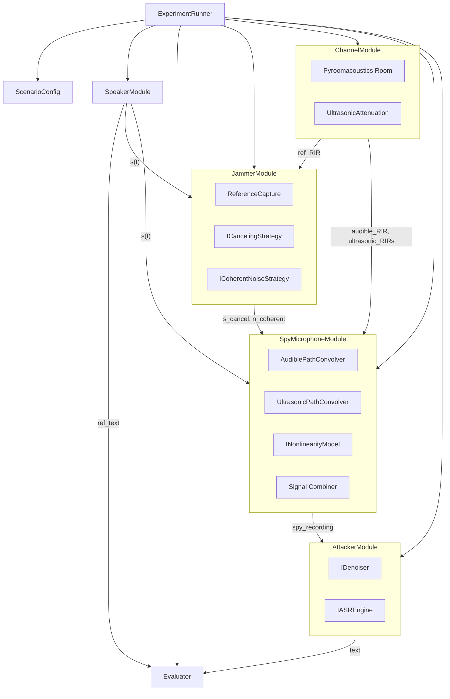

# MicFrozen 高保真声学仿真框架设计文档（修订版）

本方案基于论文 **《Cancelling Speech Signals for Speech Privacy Protection against Microphone Eavesdropping》**（Gao et al., ACM MobiCom 2023），利用 **Pyroomacoustics** 构建房间级多声源、多麦克风声学仿真平台，完整复现 MicFrozen 的"自干扰抵消 + 相干噪声耦合"机制，并支持算法模块的灵活替换与实验自动化。

---

## 1. 项目目标与约束

1.  **纯软件仿真**：不依赖任何硬件，可在一周内完成全部开发与实验。
2.  **高物理保真度**：基于房间脉冲响应（RIR）、非线性解调、超声频段衰减等真实声学效应仿真，避免过度理想化。
3.  **模块解耦与可替换算法**：干扰者和攻击者的核心算法均设计为可插拔接口，支持配置化选择，便于对比实验。
4.  **实验自动化**：通过参数网格自动运行所有仿真条件，并生成对比图表与指标报告。

**物理保真度说明**：本仿真采用"等效基带"方法——用基带信号级仿真替代完整的超声调制/解调链路。具体而言：
- 可听声路径（说话人→窃听麦）：正常通过 RIR 卷积，线性衰减。
- 超声路径（Jammer→窃听麦）：通过 RIR 卷积后再施加非线性解调模型（模拟麦克风非线性效应），并叠加额外超声频段衰减。
- 两条路径在窃听麦克风处线性叠加。

此方法保留了论文中三个关键物理效应：**房间几何与混响**（pyroomacoustics RIR）、**声路径衰减差异**（可听声 vs 超声）、**麦克风非线性解调**。简化掉的是超声载波调制/解调的实际频移计算（载波频率选择对仿真结果影响有限，因为载波影响已通过衰减系数差异表达）。

---

## 2. 总体架构

系统由 **配置层**、**物理仿真层**、**信号处理层** 和 **评估层** 组成，整体通过 `ExperimentRunner` 调度。



**关键架构变更**（与初版不同）：
- `ChannelModule` 输出两类 RIR：`audible_RIR`（可听声路径）和 `ultrasonic_RIRs`（超声路径，已叠加额外高频衰减）。
- `SpyMicrophoneModule` 分离两条信号路径：可听声路径做线性卷积，超声路径做卷积+非线性解调。**非线性仅作用于超声路径**，符合物理过程。
- `JammerModule` 的抵消信号预补偿在 `ICancelingStrategy` 中完成（而非在相干噪声生成器中）。

各模块间仅通过 **numpy 数组** 与 **配置字典** 传递数据，模块内部状态由构造函数注入，保持无副作用。

---

## 3. 模块详细设计

### 3.1 ScenarioConfig —— 全局配置

**职责**：集中管理房间几何、声源/麦克风位置、算法选择等所有参数。
**实现**：Python dataclass 或 YAML 配置文件，仅读不可变。
**示例字段**：

```yaml
sim:
  fs: 16000                   # 仿真采样率 (Hz)，基带语音
  duration: null              # 信号时长 (s)，null 表示由输入音频决定

room:
  dim: [6, 5, 3]              # 长宽高 (m)
  rt60: 0.3                   # 混响时间 (s)，与 materials 互斥——二选一
  # materials: "office"       # 材料预设 (暂不使用，pyroomacoustics 中 RT60 和材料不可混用)
  temperature: 20             # 室温 (℃)，影响声速
  humidity: 50                # 相对湿度 (%)，影响空气吸收

source:
  pos: [1.0, 2.5, 1.5]       # 说话人位置 (m)
  audio_dataset: "librispeech" # 语音数据集: "librispeech" | "audiomnist"
  audio_file: null            # 或指定单文件路径

jammer:
  pos_spk: [1.2, 2.5, 1.5]   # Jammer 超声扬声器位置 (m)
  ref_mic_pos: [1.05, 2.5, 1.5]  # 参考麦克风位置 (m)，距声源约 20cm
  canceling_strategy: "phase_inversion"
  coherent_strategy: "fixed_weight"
  system_gain_db: 36.0          # 校准增益 — 补偿超声频段衰减与基带仿真差异
  canceling_params:
    gain: 1.0                 # 相位翻转增益
    precompensate: true       # 是否启用预补偿 n(t) = -ŝ(t) - 0.5ŝ²(t)
  coherent_params:
    time_coupling: true       # 时域卷积耦合开关
    freq_coupling: true       # 频域卷积耦合开关
    mixing_dim: 3             # 混合矩阵输入维度（3 对应论文 Eq.17）

spy_mic:
  positions:                  # 窃听麦克风位置列表（支持阵列）
    - [4.0, 2.5, 1.5]
  nonlinearity: "polynomial"  # 每通道独立非线性模型
  nonlinearity_params:
    coeff: [1.0, 0.1, 0.0]  # A1, A2, A3 多项式系数

attacker:
  denoiser: "ica"
  asr: "whisper_tiny"
  denoiser_params:
    n_channels: 4             # ICA/BF 所需通道数

# 超声衰减参数
ultrasonic:
  carrier_freq: 39000         # 载波频率 (Hz)，用于衰减系数计算
  attenuation_db_per_m: 1.5   # 40kHz 空气吸收 (dB/m)，来自 ISO 9613-1
  apply_to_rir: true          # 是否对超声路径 RIR 施加额外衰减
```

**配置注意事项**：
- `rt60` 和 `materials` 互斥：pyroomacoustics 中通过 RT60 反推吸收系数和直接设置材料吸收是两种不同的房间定义方式。本项目使用 `rt60`。
- 当 `spy_mic.positions` 包含多个坐标时，`ChannelModule` 为每个麦克风生成独立 RIR，`nonlinearity_params` 默认所有通道共享，也可扩展为每通道独立配置。
- `jammer.pos_spk` 与 `jammer.ref_mic_pos` 的空间约束：参考麦克风应位于声源和 Jammer 扬声器之间，距声源约 10-20 cm。Jammer 扬声器距参考麦克风约 10 cm（符合论文 20 cm Jammer-声源距离）。

### 3.2 SpeakerModule —— 声源

**职责**：加载语音文件，返回归一化基带语音波形 `s(t)` 及参考文本。
**接口**：

```python
class SpeakerModule:
    def __init__(self, audio_path: str, fs: int = 16000):
        ...

    def get_signal(self) -> np.ndarray:
        """返回 float32 语音信号，shape=(samples,)，归一化到 [-1, 1]"""
        pass

    def get_reference_text(self) -> str:
        """返回语音对应的参考文本（用于 WER 计算）"""
        pass
```

**数据集支持**：
- LibriSpeech (`librispeech`)：从 `data/LibriSpeech/` 加载，需提供对应 `.txt` 参考文本。
- AudioMNIST (`audiomnist`)：从 `data/AudioMNIST/` 加载，数字 0-9 的语音。
- 自定义单文件：通过 `audio_file` 指定路径。

信号长度统一为 `T`，作为后续所有信号的参考长度。

### 3.3 ChannelModule —— 房间信道

**职责**：基于 Pyroomacoustics 计算所有声源到所有麦克风的脉冲响应（RIR），并对超声路径 RIR 施加额外衰减。

**关键步骤**：
1.  创建 `pra.Room` 实例，设置 `dim` 和 `rt60`（或等效吸收系数）。
2.  添加三个声源：说话人（可听声源）、Jammer 超声扬声器（单一声源，同时承载抵消信号和相干噪声——两者共享同一物理换能器）。
3.  添加两个麦克风组：参考麦克风、窃听麦克风阵列。
4.  调用 `room.compute_rir()`。
5.  **分离输出**：将 RIR 分为可听声路径和超声路径。
    - 可听声路径：`src_to_ref`、`src_to_spy[i]`——正常 RIR，不再额外处理。
    - 超声路径：`jammer_to_spy[i]`——叠加 `UltrasonicAttenuation` 处理。
6.  输出两类 RIR 字典。

**接口**：

```python
class ChannelModule:
    def __init__(self, config: Dict):
        ...

    def compute_rir(self) -> Tuple[Dict, Dict]:
        """
        Returns
        -------
        audible_rirs : Dict[str, np.ndarray]
            {"src_to_ref": (rir_len,), "src_to_spy": [(rir_len,), ...]}
        ultrasonic_rirs : Dict[str, np.ndarray]
            {"jammer_to_spy": [(rir_len,), ...]}  -- 已施加超声衰减
        """
        pass
```

**超声衰减模型**：

```python
class UltrasonicAttenuation:
    """
    对超声路径 RIR 施加额外高频衰减。

    物理依据：论文 Eq.10 中 α_H(x) 与 α_L(x) 的差异。
    40 kHz 空气吸收系数约 1.2-1.5 dB/m (ISO 9613-1)，
    而可听声 (<4 kHz) 的吸收系数约 0.001-0.01 dB/m。
    本模型对 jammer→spy 路径的 RIR 乘以 e^(-α * distance)，
    其中 α 基于 carrier_freq 和 ISO 9613-1 公式计算。
    """
    def __init__(self, carrier_freq: float, temperature: float, humidity: float):
        ...

    def apply(self, rir: np.ndarray, distance: float) -> np.ndarray:
        """对 RIR 施加超声频段衰减"""
        pass
```

**与 pyroomacoustics 的分工**：
- pyroomacoustics 负责：几何路径延迟、墙面反射、混响尾、可听声频段的空气吸收。
- `UltrasonicAttenuation` 负责：超声频段相对于可听声的**额外**空气吸收衰减。
- 两者不重复计算——pyroomacoustics 内置的空气吸收模型针对可听声频段（通常 <8 kHz），40 kHz 的吸收系数需要外部补充。

### 3.4 JammerModule —— 干扰者

**职责**：生成两个基带干扰信号：`s_cancel(t)`（抵消信号）和 `n_coherent(t)`（相干噪声）。两者均通过超声路径到达窃听麦克风。

**内部结构**：
-   `ReferenceCapture`：用 `src_to_ref` RIR 与 `s(t)` 卷积得到参考信号，模拟参考麦克风接收到的语音。
-   `ICancelingStrategy`：根据参考信号计算抵消输出，**包含预补偿逻辑**。
-   `ICoherentNoiseStrategy`：根据原始语音计算相干噪声。

**接口**：

```python
class JammerModule:
    def __init__(self, config: Dict, strategies: Dict):
        self.cancel_strategy: ICancelingStrategy = create_canceling(config)
        self.coherent_strategy: ICoherentNoiseStrategy = create_coherent(config)

    def generate(self, s_src: np.ndarray, ref_rir: np.ndarray) -> Tuple[np.ndarray, np.ndarray]:
        """
        Returns
        -------
        s_cancel : np.ndarray  抵消信号（基带）
        n_coherent : np.ndarray 相干噪声（基带）
        """
        ref = fftconvolve(s_src, ref_rir)[:len(s_src)]
        # 参考信号RMS归一化 — 补偿近场RIR增益
        rms_src = sqrt(mean(s_src²)) or 1.0
        rms_ref = sqrt(mean(ref²)) or 1.0
        ref = ref * (rms_src / rms_ref)
        s_cancel = self.cancel_strategy.compute(ref)
        n_coherent = self.coherent_strategy.compute(s_src)
        # 应用系统校准增益 (补偿超声衰减、基带仿真差异)
        gain_linear = 10 ** (system_gain_db / 20)
        s_cancel *= gain_linear
        n_coherent *= gain_linear
        return s_cancel.astype(np.float32), n_coherent.astype(np.float32)
```

#### 3.4.1 抵消策略接口

```python
class ICancelingStrategy(ABC):
    @abstractmethod
    def compute(self, ref_signal: np.ndarray) -> np.ndarray:
        """根据参考信号生成反相抵消信号（基带输出）"""
        pass
```

**内置实现**：

-   `PhaseInversionCanceling`：`s_cancel = -gain * ref_signal`。
    启用 `precompensate` 时，按照论文 Eq.9 执行预补偿：
    ```
    s_cancel = -gain * ref_signal - 0.5 * gain² * ref_signal²
    ```
    预补偿抵消了非线性解调过程中产生的 ŝ²(t) 项，使解调后的基带残留仅为高阶小量 (0.5ŝ³ + 0.125ŝ⁴)。

-   `AdaptiveFilterCanceling`（对标论文 5.3 节 NLMS 自适应滤波器）：
    使用 NLMS 算法在线估计从 Jammer 到窃听麦的逆信道 `h_rc`。
    ```
    初始化: h_rc = zeros(M)  (M 为滤波器抽头数)
    每个采样点:
      x = ref_signal[t-M:t]
      e = desired[t] - h_rc @ x    # 期望输出 = 0（完全抵消）
      h_rc += mu / (delta + ||x||^2) * e * x
      s_cancel[t] = h_rc @ x
    ```
    此实现模拟论文 Eq.13 的 NLMS 迭代，适用于未知窃听位置的场景。
    **注意**：纯仿真下没有真实反馈通道，`desired[t]` 用 0 近似（理想抵消目标）。

#### 3.4.2 相干噪声策略接口

```python
class ICoherentNoiseStrategy(ABC):
    @abstractmethod
    def compute(self, speech: np.ndarray) -> np.ndarray:
        """根据语音信号生成相干噪声（基带输出）"""
        pass
```

**内置实现**：

-   `FixedWeightCoherentNoise`：严格按照论文 Eq.17 生成噪声。
    ```
    n_co(t) = n_T(t) * [ A_{1×3} · sgm( s(t), n_M(t), n_F(t)·s(t) )^T ]
    ```
    其中：
    - `n_M(t)`：高斯随机噪声 ~ N(0, 0.5)
    - `n_F(t)`：高斯随机噪声 ~ N(0, 0.3)
    - `n_T(t)`：时域卷积噪声（保证时域不可分离性），长度取 0.1-0.5 秒
    - `A_{1×3}`：1×3 随机非奇异混合矩阵，元素 ~ N(0.2, 0.8)
    - `sgm(x) = 1 - e^{-x} / (1 + e^{-x})`：sigmoid 激活函数（论文 Eq.15）
    - `*`：卷积操作

    三层结构保证：
    1.  **时域不可分离**：`n_T(t)` 卷积使噪声与语音在任意时间延迟上都耦合。
    2.  **频域不可分离**：`n_F(t)·s(t)` 的卷积特性使频率滤波导致语音严重失真。
    3.  **空间域不可分离**：Jammer 与声源空间接近（由配置中位置决定）。

-   `BaselineGaussianNoise`：4 kHz 带宽高斯噪声（论文基线，用于对比实验）。
    注意：传统的 Gaussian Noise UMJ 生成的噪声是**独立的**（不与语音耦合），这正是 MicFrozen 要优于它的原因。

-   `BaselineSweepingNoise`：0-4 kHz 扫频噪声（论文基线）。
-   `BaselineHoppingNoise`：4 kHz 内跳频噪声（论文基线）。

### 3.5 SpyMicrophoneModule —— 窃听麦克风

**职责**：模拟窃听麦克风的物理接收过程——可听声语音线性到达，超声干扰经非线性解调后到达，两者叠加为窃听录音。

**物理过程（论文描述）**：
1.  语音 `s(t)` 通过空气直接到达麦克风 → 线性路径。
2.  Jammer 发射的超声信号（载有 `s_cancel` + `n_coherent`）在麦克风处因非线性被解调到基带。
3.  两个基带分量叠加，形成窃听录音。

**仿真实现**：

```python
class SpyMicrophoneModule:
    def __init__(self, audible_rirs: Dict, ultrasonic_rirs: Dict,
                 nonlinearity: INonlinearityModel):
        ...

    def capture(self, s_src: np.ndarray, s_cancel: np.ndarray,
                n_coherent: np.ndarray) -> np.ndarray:
        """
        分两条路径计算窃听录音：
        1. 可听声路径 (线性)：s_src * rir_src_to_spy
        2. 超声路径 (非线性)：(s_cancel + n_coherent) * rir_jammer_to_spy
           → 经非线性解调 → 基带干扰
        3. 叠加：recording = audible_path + demodulated_ultrasonic_path
        """
        # 可听声路径（线性，不施加非线性）
        spy_speech = fftconvolve(s_src, self.rir_src_to_spy)[:len(s_src)]

        # 超声路径：Jammer 基带信号组合（两者由同一换能器发射）
        jammer_baseband = s_cancel + n_coherent

        # 超声路径：卷积 + 非线性解调
        ultrasonic_arrival = fftconvolve(jammer_baseband, self.rir_jammer_to_spy)[:len(s_src)]
        jammer_demod = self.nonlinearity.apply(ultrasonic_arrival)

        # 叠加
        return spy_speech + jammer_demod
```

**关键修正**：非线性仅施加于超声路径，可听声语音路径保持线性。这纠正了初版中"线性混合后整体加非线性"的物理错误。

**非线性接口**：

```python
class INonlinearityModel(ABC):
    @abstractmethod
    def apply(self, signal: np.ndarray) -> np.ndarray:
        """
        模拟麦克风非线性响应。
        y = A1*x + A2*x^2 + A3*x^3 + ...
        """
        pass
```

-   `PolynomialNonlinearity(coeff)`：`y = sum(coeff[i] * x^(i+1))`，默认 `[1.0, 0.1]`。
-   `PassThroughNonlinearity`：恒等映射 `y = x`，用于调试或模拟理想线性麦克风。

**多通道阵列**：当 `spy_mic.positions` 包含 N 个坐标时，`capture()` 返回 `(N, samples)` 的 numpy 数组。每个通道使用对应位置的独立 RIR 和非线性参数。

### 3.6 AttackerModule —— 攻击者

**职责**：接收窃听录音（可能多通道），执行去噪和语音识别。

**接口**：

```python
class AttackerModule:
    def __init__(self, denoiser: IDenoiser, asr: IASREngine):
        ...

    def attack(self, recording: np.ndarray) -> Tuple[np.ndarray, str]:
        """
        Parameters
        ----------
        recording : np.ndarray, shape=(samples,) or (n_channels, samples)

        Returns
        -------
        enhanced : np.ndarray  去噪后的信号
        transcription : str    ASR 转录文本
        """
        enhanced = self.denoiser.denoise(recording)
        transcription = self.asr.transcribe(enhanced)
        return enhanced, transcription
```

#### 3.6.1 去噪器接口

```python
class IDenoiser(ABC):
    @abstractmethod
    def denoise(self, audio: np.ndarray) -> np.ndarray:
        """对窃听录音去噪，返回增强信号"""
        pass
```

**内置实现**（与论文 Sec.8.1 Denoising Methods 对齐）：

| 去噪器 | 对应论文方法 | 所需通道数 | 说明 |
|--------|------------|-----------|------|
| `ICADenoiser` | FastICA BSS [33] | ≥2 | 利用多通道信号独立性分离语音与噪声 |
| `SpectralSubtraction` | STFT 频域滤波 | 1 | 估计噪声功率谱并从混合信号中减去 |
| `BandstopFilter` | 陷波滤波 | 1 | 对已知干扰频带进行陷波 |
| `DelaySumBeamformer` | TDOA 波束成形 | ≥2 | 利用到达时间差增强特定方向信号 |
| `AdaptiveNoiseFilter` | NLMS ANF + sniffer [32] | 1 | 嗅探器辅助的自适应噪声滤波（需参考噪声信号） |
| `NoDenoiser` | 无（raw recording） | 1 | 透传，用于评估原始干扰效果 |

`AdaptiveNoiseFilter` 模拟论文 3 节描述的 sniffer-assisted 攻击：攻击者通过超声嗅探器捕获 Jammer 发射的超声信号，将其解调后作为 NLMS 自适应滤波器的参考输入来消除噪声。这是论文评估的四种主要去噪方法之一。

#### 3.6.2 语音识别接口

```python
class IASREngine(ABC):
    @abstractmethod
    def transcribe(self, audio: np.ndarray) -> str:
        """将语音转为文本"""
        pass
```

-   `WhisperASR`：加载 OpenAI Whisper `tiny` 或 `base` 模型，离线运行。
-   `GoogleSTT`：调用 Google Cloud Speech-to-Text API（需联网，对应论文中使用的 Google STT [29]）。
-   `DummyASR`：直接返回已知参考文本（用于快速 WER 计算模拟，不依赖外部模型）。

### 3.7 Evaluator —— 评估器

**职责**：计算 SNR、CWER（Cooperative Word Error Rate），生成对比图表。
**与论文对齐**：论文使用 SNR 和 CWER 作为核心指标（论文 Sec.8.1 Evaluation Metrics）。

**接口**：

```python
class Evaluator:
    def evaluate(self, ref_signal: np.ndarray, spy_signal: np.ndarray,
                 enhanced_signal: np.ndarray, ref_text: str,
                 hyp_text: str) -> Dict:
        """
        Returns
        -------
        metrics : Dict with keys:
            snr_raw : float       # 窃听原始录音的 SNR（相对于原始语音）
            snr_enhanced : float  # 去噪后信号的 SNR
            cwer_raw : float      # 窃听原始录音的 CWER（%）
            cwer_enhanced : float # 去噪后转录的 CWER（%）
        """
        snr_raw = compute_snr(ref_signal, spy_signal)
        snr_enhanced = compute_snr(ref_signal, enhanced_signal)
        cwer_raw = compute_cwer(ref_text, transcribe_raw(spy_signal))
        cwer_enhanced = compute_cwer(ref_text, hyp_text)
        return {
            "snr_raw": snr_raw,
            "snr_enhanced": snr_enhanced,
            "cwer_raw": cwer_raw,
            "cwer_enhanced": cwer_enhanced,
        }
```

**指标说明**：
- **SNR**：`SNR = 10*log10(||s||^2 / ||s - s_est||^2)`，反映语音信号相对于噪声/干扰的强度。
  论文：MicFrozen 达到 SNR = -13.6 dB（raw），-14.3 dB（after denoising）。
- **CWER**：`CWER = (S + D + I) / N * 100%`，即词错误率（WER）的补集视角——未被正确识别的词的比例。
  论文：MicFrozen 达到 CWER > 96.9%（raw），> 86.9%（after denoising）。
- 保留 WER 作为辅助指标，但主报告使用 CWER（与论文一致）。
- 不包含 PESQ：PESQ 设计用于语音编解码器评估，不适用于反窃听场景的性能度量。

**图表生成**：
- `snr_vs_distance`：不同距离下的 SNR 对比（MicFrozen vs Gaussian-noise UMJ）。
- `cwer_vs_distance`：不同距离下的 CWER 对比。
- `coverage_heatmap`：2D 空间区域的 CWER 热力图（论文 Fig.11），通过对空间网格逐点仿真或空间插值生成。

### 3.8 基线干扰器模块

为支持论文 Sec.8.2 的对比实验，需要实现以下基线干扰策略（作为 `ICoherentNoiseStrategy` 的特化，因为基线本质上是独立噪声，不依赖语音）：

| 基线名称 | 噪声类型 | 参数 | 来源 |
|---------|---------|------|------|
| `GaussianNoiseJammer` | 4 kHz 带宽高斯噪声 | bandwidth=4000 Hz | 论文 baseline |
| `SweepingNoiseJammer` | 0-4 kHz 扫频噪声 | sweep_range=[0, 4000] Hz | [48] |
| `HoppingNoiseJammer` | 4 kHz 内跳频噪声 | hop_range=[0, 4000] Hz | [15] |

这些基线在架构中的位置：作为独立的 `JammerModule` 实例（仅生成噪声，无抵消信号），传递给 `SpyMicrophoneModule` 时 `s_cancel` 为零向量。

---

## 4. 实验运行器

`ExperimentRunner` 负责遍历预设的参数网格（距离、角度、干扰策略、去噪算法等），串行/并行运行所有组合，并收集结果。

**使用方式**：

```python
runner = ExperimentRunner("configs/base.yaml", param_grid)
runner.run()
runner.export_results("results/exp1.csv")
runner.plot_snr_vs_distance("results/exp1_snr.png")
runner.plot_cwer_vs_distance("results/exp1_cwer.png")
runner.plot_coverage_heatmap("results/exp1_heatmap.png")
```

**参数网格示例**：

```yaml
grid:
  spy_mic_distance: [1.0, 2.0, 3.0, 5.0]        # 论文 Fig.10 的距离扫描
  jammer.canceling_strategy: ["phase_inversion", "adaptive_filter"]
  jammer.coherent_strategy: ["fixed_weight", "gaussian_baseline", "sweeping_baseline", "hopping_baseline"]
  attacker.denoiser: ["ica", "beamforming", "spectral_subtraction", "bandstop", "adaptive_noise_filter", "none"]
  spy_mic_angle: [0, 15, 30, 45, 60]            # 论文 Fig.11 的角度扫描
```

**实验流程**：
1. 加载 `ScenarioConfig`，解析参数网格。
2. 对每个网格组合，修改对应配置字段。
3. 实例化所有模块，运行单次仿真。
4. 收集 `snr_raw`, `snr_enhanced`, `cwer_raw`, `cwer_enhanced`。
5. 汇总为 CSV 并生成对比图表。

---

## 5. 仿真工作流程（单次运行）

1.  **初始化**：加载 `ScenarioConfig`，实例化所有模块。
2.  **加载语音**：`s, ref_text = speaker.get_signal(), speaker.get_reference_text()`。
3.  **计算 RIR**：`audible_rirs, ultrasonic_rirs = channel.compute_rir()`。
4.  **生成干扰**：`s_cancel, n_coherent = jammer.generate(s, audible_rirs["src_to_ref"])`。
5.  **窃听采集**：`spy_rec = spy_module.capture(s, s_cancel, n_coherent)`。
6.  **攻击处理**：`enh, hyp_text = attacker.attack(spy_rec)`。
7.  **评估**：`metrics = evaluator.evaluate(s, spy_rec, enh, ref_text, hyp_text)`。
8.  **批量运行**：`ExperimentRunner` 循环以上步骤并汇总。

---

## 6. 高保真实现注意事项

1.  **抵消信号预补偿**：`PhaseInversionCanceling` 在启用 `precompensate=True` 时，按论文 Eq.9 生成 `n(t) = -ŝ(t) - 0.5ŝ²(t)`，使信号经麦克风非线性 `y = A1*x + A2*x²` 解调后，基带输出为 `-ŝ(t) + 高阶小量`，实现精确抵消。预补偿属于抵消策略，**不在**相干噪声生成器中。

2.  **非线性施加范围**：`INonlinearityModel` **仅作用于超声路径**（Jammer→窃听麦），不作用于可听声语音路径。`capture()` 方法中两条路径在非线性解调后才叠加，贴合物理解调发生在麦克风硬件层的本质。

3.  **超声衰减差异**：论文 Eq.10 中 `α_L(x) ≠ α_H(x)`。在仿真中，可听声路径使用 pyroomacoustics 原生 RIR，超声路径的 RIR 额外乘以 `e^(-α * distance)`（`UltrasonicAttenuation` 模块），其中 α 基于 40 kHz 吸声系数（ISO 9613-1 约 1.2-1.5 dB/m）。这种频段间衰减差异是 MicFrozen 距离性能下降（远距离可听声残余更多）的根因。

4.  **抵消信号时序**：依赖 Pyroomacoustics 的 RIR 自然包含延迟，Jammer 内部不需手动对齐。相位差、多径干扰均自动体现。

5.  **阵列处理**：当 `spy_mic.positions` 为多坐标时，`ChannelModule` 生成多通道 RIR，`AttackerModule` 的 `DelaySumBeamformer` 和 `ICADenoiser` 可利用多通道信息。

6.  **Jammer 单声源设计**：`s_cancel` 和 `n_coherent` 由同一 Jammer 换能器发射（在 `SpyMicrophoneModule.capture()` 中将两者相加后再做超声路径卷积），物理上对应论文中同一超声扬声器同时发射抵消信号和相干噪声的场景。

---

## 7. 最终交付清单

-   **代码项目**（Python，项目结构）：

    ```
    srtp-final/
    ├── configs/                # YAML 配置文件
    │   ├── base.yaml           #   默认完整配置
    │   └── grid.yaml           #   参数网格配置
    ├── src/                    # 核心模块实现
    │   ├── __init__.py
    │   ├── config.py           #   ScenarioConfig (dataclass + YAML parser)
    │   ├── speaker.py          #   SpeakerModule
    │   ├── channel.py          #   ChannelModule + UltrasonicAttenuation
    │   ├── jammer.py           #   JammerModule
    │   ├── spy_mic.py          #   SpyMicrophoneModule
    │   ├── attacker.py         #   AttackerModule
    │   ├── evaluator.py        #   Evaluator
    │   ├── modulation.py       #   超声调制/解调辅助函数
    │   └── report.py           #   结果报告生成
    ├── strategies/             # 可插拔策略实现
    │   ├── __init__.py
    │   ├── canceling.py        #   PhaseInversionCanceling, AdaptiveFilterCanceling
    │   ├── coherent.py         #   FixedWeightCoherentNoise + 三种基线噪声
    │   ├── denoiser.py         #   ICA, SpectralSubtraction, Bandstop, Beamformer, ANF
    │   ├── asr.py              #   WhisperASR, GoogleSTT, DummyASR
    │   └── nonlinearity.py     #   PolynomialNonlinearity, PassThroughNonlinearity
    ├── runner.py               # ExperimentRunner (批量参数扫描)
    ├── run_single.py           # 单次运行演示脚本
    ├── run_grid.py             # 批量实验入口脚本
    └── tests/
        ├── __init__.py
        └── test_modules.py     # 模块单元测试与集成测试
    ```

-   **示例配置文件**：`base.yaml`，包含全部可配置项及注释说明。
-   **单次运行演示脚本**：`run_single.py`，加载单个配置并运行完整链路，输出指标和波形图。
-   **批量实验脚本**：`run_grid.py`，读取网格配置生成报告和对比图表。
-   **测试用例**：验证各策略可独立运行、模块拼接正确、RIR 计算有效。

---

## 8. 预期实验效果

-   成功复现论文核心图表：不同距离下 MicFrozen 与高斯噪声 UMJ 的 SNR/CWER 对比（论文 Fig.10）。
-   展示 MicFrozen 在去噪攻击下的韧性：去噪后 CWER 保持 ≥85%，而高斯噪声基线降至 ~50%（论文 Fig.10(b)）。
-   展示相干噪声在 BSS 去噪下的不可分离性（论文 Fig.7）。
-   通过 pyroomacoustics 生成 2D 覆盖热力图，直观反映抵消信号的空间衰减和超声衰减的综合影响（论文 Fig.11）。
-   对比三种基线 UMJ（高斯/扫频/跳频）与 MicFrozen 的性能差异（论文 Sec.8.10）。

---

**本方案无硬件依赖，所有组件均可在一周内完成编码与实验，产出可直接用于科研汇报的仿真平台与结果图表。**
